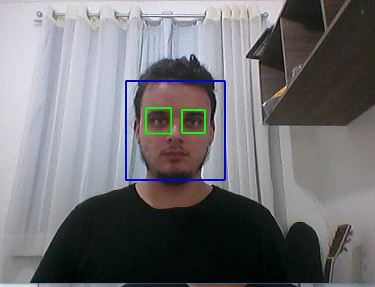
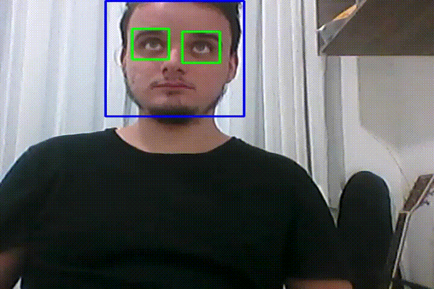
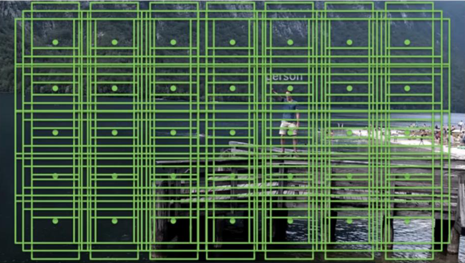
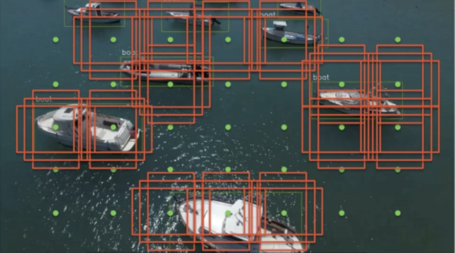
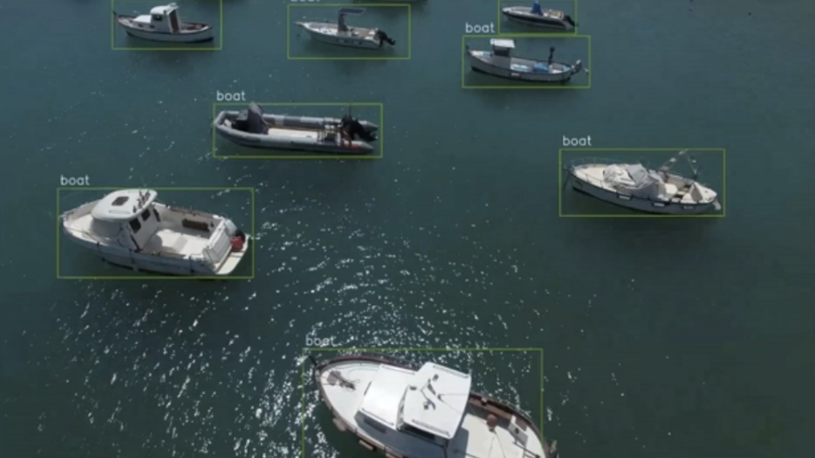

<h3>Hi, my name is Ivo Stinghen and welcome to my computer-vision repository!

<h4>What is the main structure used here?

- Spider as an IDE
- Anaconda as a virtual environment
- Python 3.6
- Opencv
- Computer Vision Algorithms,Trained Base and Classifiers

<h4>What the algorithms can do?

- Face recognition - Haar Cascade
  

- Smile recognition - Haar Cascade 

- Object recognition - Single Shot Detector (SSD) 

- Moving objects recognition - Single Shot Detector (SSD) 

